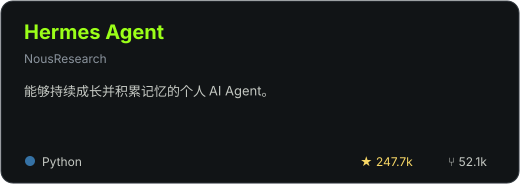
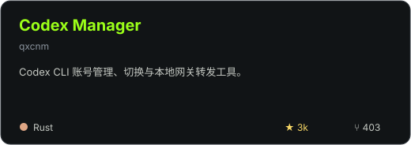
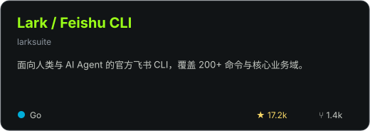
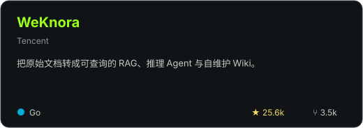
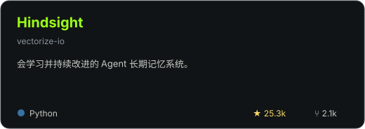
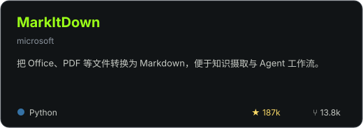

  

  

   

  
  
  

 

## 你好，我是臻香 👋

**AI 工具实践者与独立构建者**，关注 AI Agent、个人知识系统、本地模型与工作流自动化。

- 🧠 探索能够持续成长、拥有长期记忆的个人 AI Agent
- 🧩 使用 Codex、Hermes 与飞书搭建可复用的自动化工作流
- 📝 把真实部署过程、踩坑记录和解决方案整理成公开内容

  
<h2>🚀 当前实践</h2>

  
最近更新的公开原创项目。新建项目或推送更新后会自动刷新；Fork、私有与归档仓库不会展示。

<!--START_SECTION:current_projects-->
<table>
  <tr>
    <td width="50%" valign="top">
      <a href="https://github.com/Zhenxiangai/link-video-downloader-zhenxiangai"><strong>link-video-downloader-zhenxiangai</strong></a> 
      把视频号、B站、小红书或抖音链接发给 Hermes，在 Mac 本地完成下载、整理和逐字稿；支持视频号、B站、抖音博主批量抓取。 
      Python · 最近更新 2026-08-17
    </td>
    <td width="50%" valign="top">
      <a href="https://github.com/Zhenxiangai/zhenxiang-hermes-knowme"><strong>zhenxiang-hermes-knowme</strong></a> 
      暂无项目简介 
      最近更新 2026-08-07
    </td>
  </tr>
</table>
<!--END_SECTION:current_projects-->

  
<h2>🌟 Open Source Radar</h2>

  
我正在使用或重点关注的开源项目。它们来自个人收藏，不代表由我开发或维护。

  

    
    
    
    
    
    
  

  Star 与 Fork 为 2026-07-26 数据快照；点击卡片可查看实时数据。

  
<h2>🧰 我的 AI 工具箱</h2>

  <h3>🤖 AI 与 Agent</h3>

  

    
    
    
    
    
  

  <h3>🛠️ 构建与部署</h3>

  

    
    
    
    
    
    
  

  <h3>🗂️ 知识与工作流</h3>

  

    
    
    
    
  

  
<h2>📊 GitHub 数据与活动</h2>

  

    
    
    
  

   

  

    
  

  <h3>⚡ 最近 GitHub 活动</h3>

  <!--START_SECTION:activity-->
1. 🚀 Published release [v1.2.1 — 公众号隐私加固与无人值守批量](https://github.com/Zhenxiangai/link-video-downloader-zhenxiangai/releases/tag/v1.2.1) in [Zhenxiangai/link-video-downloader-zhenxiangai](https://github.com/Zhenxiangai/link-video-downloader-zhenxiangai)
  <!--END_SECTION:activity-->

<!--
YouTube、赞助、徽章墙和“参与过的开源项目”暂不展示。
等出现真实频道内容、赞助关系、活动徽章或开源贡献后再开启。
-->

 

  持续构建，持续记录，让复杂工具变得更容易使用。

